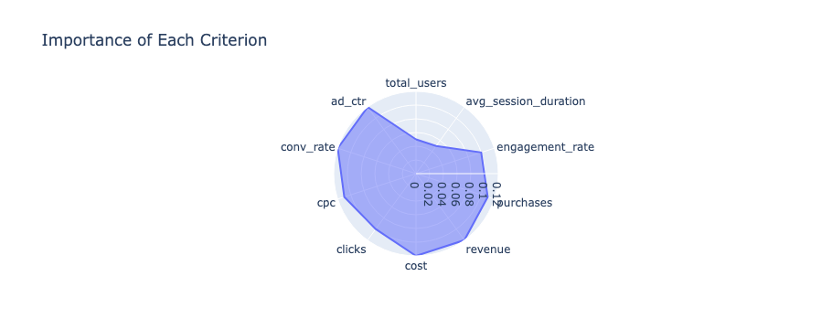

# Multi Criteria Decision Making to Evaluate Campaign Performance

This project can help you evaluate your Meta & Google Ads campaigns & help you decide how to allocate your budget. Step-by-step walkthrough can be found in [the Jupyter Notebook file.](mcdm.ipynb)

## License

This project is licensed under the MIT License.

### Third-Party Licenses

This project makes use of the [mcdm](https://github.com/akestoridis/mcdm) module which is licensed under the MIT License by Dimitrios-Georgios Akestoridis. The full text of the license can be found in the LICENSE file within the `mcdm` module's repository.
